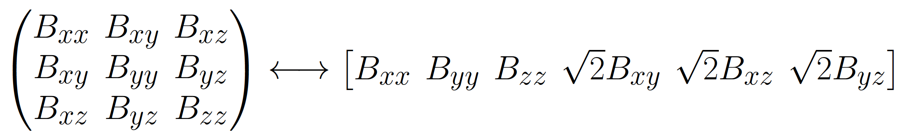

# QTI+ & QTI±: Matlab Implementation

This repository contains the Matab implementation of the routines used in the papers [Q-space trajectory imaging with positivity constraints (QTI+)](https://www.sciencedirect.com/science/article/pii/S1053811921004754) by Herberthson et. al., and [Diffusivity-limited q-space trajectory imaging](https://www.sciencedirect.com/science/article/pii/S2772516223000013?via%3Dihub) by Boito et al..  Here you will find information regarding the installation and basic usage of the library. For details regarding the methods, and for their nomenclature, we refer you to the papers.

In what follows, you will find how to quickly start using the software for analysing your data. For more details and information, and for examples on how to use the softare, please consult the user guide.


# Quick start

## Installing CVX
In order to use the routines in this library, [CVX](http://cvxr.com/cvx/) needs to be installed. CVX is free to download and install, and comes with a few free solvers that can be readily used upon installation. If CVX is not already installed, please visit the [download page](http://cvxr.com/cvx/download/) and download the option that suits you. Please consult the [installation page](http://cvxr.com/cvx/download/) for instruction on how to install CVX on your machine.

Note that in our implementation we favoured Mosek as the solver to be used. Even though Mosek can be obtained together with CVX (depending on which bundle you download), it requires a licence in order to be used. Such licence is free for academic purposes, and instructions on how to obtain the licence and where to place it in your machine can be found [here](http://cvxr.com/cvx/doc/mosek.html).  If Mosek is not available, the QTI+ routines will use another solver that ships with CVX, SDPT3.


## Installing QTI+ & QTI±

All the codes for QTI+ & QTI± are written in Matlab, meaning that is it sufficient to either clone or download the files from this Github page, and add them to you Matlab path to start using it. The function *qtiplus_setup* may assist in adding all the folders to the path.


## Data and B-tensors format
The required inputs to the QTI+ routines are the data and the b-tensors used to collect them. The data is expected to be a Matlab matrix with shape [nx, ny, nz, ndiffusion], where ndiffusion indicates that the diffusion volumes are stacked along the 4th dimension. nx, ny, and nz are the number of voxels for each dimension. The b-tensors are expected to be shaped as a 2D Matlab matrix with shape [ndiffusion, 6], where the number of rows represents the number of collected diffusion volumes, and each row contain one b-tensor in Voigt format. The following convention for converting a B-tensor from a 3x3 matrix representation to its 1x6 Voigt vector representation is adopted:
 

There are functions beginning with the name **convert_**  in the *helper functions*  folder which may assist you in switching from one representation to the other.

**Please note that the B-tensors are expected to have SI units (s/m^2)**


## Analysing the data with the default parameters
The function **qti_plus** fit is the main function in the package and is the one to be used to perform the fit. The most basic function call is

```matlab
[model, invariants] = qtiplus_fit(data,btensors)
```

With this function call, the QTI model is fitted to the data using SDPdc, i.e. the positivity constraints on the mean Diffusion and on the Covariance tensor are enforced using Semidefinite Programming. By default, the function will try to run operations in parallel, and will send 50 voxels at a time to the SDP solver.

If you have a mask available, it can be passed as input in the following way

```matlab
[model, invariants] = qtiplus_fit(data,btensors,'mask',mask)
```

If a mask is not passed as input, a simple one will be created to avoid unnecessary computations. Therefore, in case it is desired to have the computations performed over all voxels in the dataset, it is recommended to pass the correspective mask to the software.

The fit returns 2 variables: a 4D matrix, here called *model*, containing the QTI model parameters, in the following fashion:

- model(x, y ,z, 1)      = S0, non diffusion weighted signal, in arbitrary units
- model(x, y, z, 2:7)   = Diffusion tensor unique elements (6), in m^2/s
- model(x, y, z, 8:28) = Covariance tensor unique elements (21), in m^4/s^2

and a structure, here called *invariants*, containing the scalar maps derived from the estimated quantities. For the nomenclature of the various scalar, see the paper from [Westin et. al](https://pubmed.ncbi.nlm.nih.gov/26923372/).  The Mean Diffusivity MD is returned in um^2/ms, while S0 is returned in arbitrary units.


## Optional Parameters

Optional parameters can be passed to the function using key-value pairs. For more details, please consult the user guide.

Available options concern the choice of SDP solver (*solver*), which of the fitting routines to employ (*pipeline*), the number of voxels to be fitted simultaneously (*nvox*), whether or not to use parallel computations (*parallel*), and possible indexes of measurements to exclude from the fitting (*ind*).

### pipeline
Pre-constructed pipelines can be identified via integers as follows:

- 0 : SDPdc (default)
- 1 : SDPdc followed by NLLSdc
- 2 : SDPdc followed by NLLSdc, m)-check, and SDPdcm
- 3 : SDPdc followed by NLLSdc and SDPdcm
- 4 : SDPdc followed by m)-check and SDPdcm
- 5 : SDPdc followed by SDPdcm
- 6: SDPdc±
- 7: SDPdc± followed by SDPdcm±
- 8: SDPdc± followed by m)-check and SDPdcm±
- 9: SDPd
- 10: SDPd followed by NLLSd
- 11: SDPd±

where options 9, 10, and 11 perform constrained DTI fitting only. 

For example, the following code

```matlab
[model, invariants] = qtiplus_fit(data,btensors,'pipeline', 2)
```

will fit the data with SDPdc, NLLSdc, m)-check, and SDPdcm.

As default, only SDPdc is performed. This choice is dictated by the excellent results obtainable with this step alone, and by computational considerations.

### D0 

If one of the QTI± (or DTI±) routines is selected (pipeline options 6, 7, 8, 11), a value for the maximum allowed diffusivity needs to be specified (in units of µm^2/ms). By default, this is set to D0 = 3.1 µm^2/ms.  

```matlab
[model, invariants] = qtiplus_fit(data,btensors,'D0', 3.3)
```

### solver

As mentioned above, we suggest using Mosek over SDPT3. This mostly concerns speed performance, as the final results should not depend on the adopted solver. By default, QTI+ will try to use Mosek, and if not available will resource to SDPT3. However, should you have both solvers available and still prefer SDPT3 over Mosek, there is chance to enforce this choice via the keyword *solver* in the following fashion:

```matlab
[model, invariants] = qtiplus_fit(data,btensors,'solver','sdpt3')
```

### index
With the key word *index* the user can decide whether to exclude measurements from the computations. For example, it is sometimes beneficial to exclude diffusion volumes acquired withouth diffusion sensitivity (i.e., b-value = 0). In this case, it is sufficient to create a vector of ones with the same size as the number of diffusion volumes in the dataset, and set to 0 the values at the measuremets' positions which are to be ignored. For example, if the dataset consists of 10 diffusion volumes, and the first 3 are to not be considered for the computations, the following vector can be passed to the fitting function:

```matlab
ind = [0 0 0 1 1 1 1 1 1 1];
[model, invariants] = qtiplus_fit(data,btensors,'ind',ind)
```

### nvox

The key word *nvox* allows the user to decide how many voxels to process at a time with the *CVX* solver. From our experience, 50 is about the right choice to promote a significant computational speed increase. Higher values for *nvox* might be counterproductive and lead to slow fitting.

### parallel

The key word *parallel* allows the user to decide whether to run computations over multiple cores. By default, the code checks whether the parallel computing toolbox is available, and if so, it runs computations on all available workers. To not run computations in parallel, set the value for this key to 0:

```matlab
[model, invariants] = qtiplus_fit(data,btensors,'parallel',0)
```

# Examples

There are two examples in the package showing how to use the main functionalities of the software. One example, contained in the script *example_qtiplus_fit_synthetic_data* , makes use of synthetic data which are available in the *example dataset* folder. The other example, contained in the script *example_qtiplus_fit_experimental_data* requires the brain data acquired with a tensor-valued diffusion encoding sequence described in [Szczepankiewicz et al.](https://www.sciencedirect.com/science/article/pii/S2352340919305621?via%3Dihub) ,and available [here](https://github.com/filip-szczepankiewicz/Szczepankiewicz_DIB_2019). To run this example, the user is required to autonomosly download the data. More information about the examples can be found in the User Guide.


# References

If you use this package in your Research, please cite the following articles:

> [1] Herberthson M, Boito D, Haije TD, Feragen A, Westin CF, Özarslan E. Q-space trajectory imaging with positivity constraints (QTI+). Neuroimage. 2021 May 21;238:118198. doi: 10.1016/j.neuroimage.2021.118198. Epub ahead of print. PMID: 34029738. 

```latex
@article{Herberthson2021,
	author = {Magnus Herberthson and Deneb Boito and Tom {Dela Haije} and Aasa Feragen and Carl-Fredrik Westin and Evren \"Ozarslan},
	journal = {NeuroImage},
	pages = {118198},
	title = {Q-space trajectory imaging with positivity constraints (QTI+)},
	volume = {238},
	year = {2021}}
```

> [2] Boito D, Herberthson M, Dela Haije T, Blystad I, Özarslan E. Diffusivity-limited q-space trajectory imaging. Magnetic Resonance Letters. Volume 3, issue 2, May 2023, Pages 187-196. doi:https://doi.org/10.1016/j.mrl.2022.12.003
```latex
@article{Boito2021,
title = {Diffusivity-limited q-space trajectory imaging},
journal = {Magnetic Resonance Letters},
volume = {3},
number = {2},
pages = {187-196},
year = {2023},
note = {Magnetic Resonance in Porous Media},
issn = {2772-5162},
doi = {https://doi.org/10.1016/j.mrl.2022.12.003},
url = {https://www.sciencedirect.com/science/article/pii/S2772516223000013},
author = {Deneb Boito and Magnus Herberthson and Tom {Dela Haije} and Ida Blystad and Evren Özarslan}}

```

> [3] Deneb Boito, Magnus Herberthson, Tom Dela Haije, Evren Özarslan, Applying positivity constraints to q-space trajectory imaging: The QTI+ implementation, SoftwareX, Volume 18, 2022, 101030, ISSN 2352-7110, doi:https://doi.org/10.1016/j.softx.2022.101030.

```latex
@article{Boito2022,
title = {Applying positivity constraints to q-space trajectory imaging: The QTI+ implementation},
journal = {SoftwareX},
volume = {18},
pages = {101030},
year = {2022},
issn = {2352-7110},
doi = {https://doi.org/10.1016/j.softx.2022.101030},
url = {https://www.sciencedirect.com/science/article/pii/S2352711022000322},
author = {Deneb Boito and Magnus Herberthson and Tom {Dela Haije} and Evren Özarslan}}
```


# Contact 

Should you have any question regarding the software, please send an email to

>  deneb.boito@liu.se
